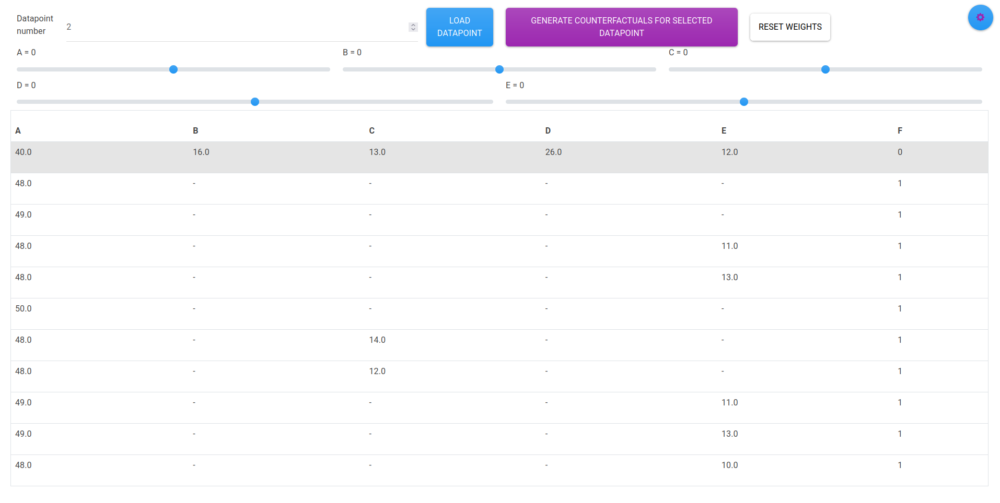
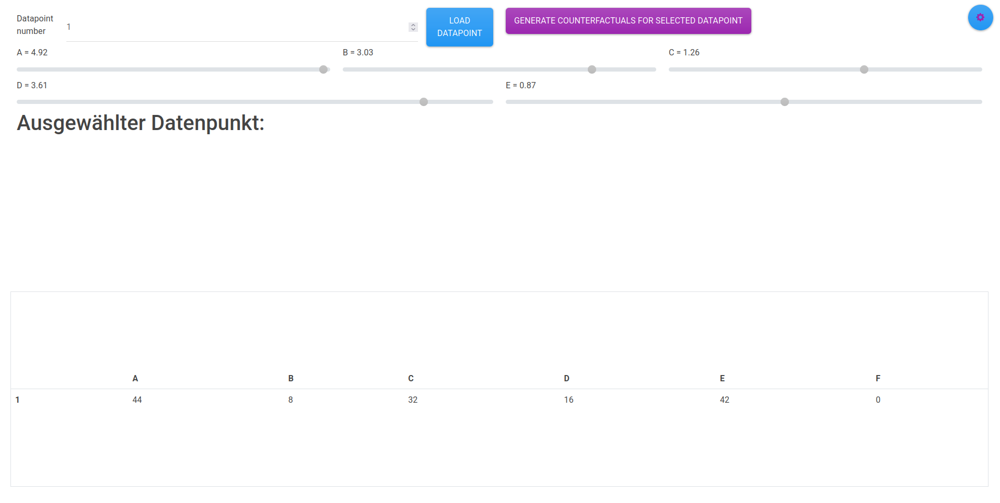

# Archive for counterfactual user study

Code to reproduce userstudy as laid out here (Link will be added upon publication ~autumn 2025)

Steps for reproduction:
* Use python3.11
* Install this repo and the [counterfactual generator](https://github.com/finnschwall/counterfactual_user_study) 
* open working_dir/plugins/data.py and change line 22 to your python bin. You can use this to find the correct path
python3 -c "import sys;print(sys.path)"
* cd working_dir
* rixaserver migrate
* rixaserver runserver
* go to http://127.0.0.1:8000/de/dashboard/userstudy

Everything should work now

In working_dir/secret_config.py you can switch between the different study modes.

The settings for counterfactual generation can be found in working_dir/plugins.
What the settings mean can be understood by looking into the [counterfactual generator](https://github.com/finnschwall/counterfactual_user_study) 
# Screenshots
## Standard



## Random


## Static


# Original readme.md
This is the readme of the [rixa](https://github.com/finnschwall/rixa) version used for the study

<br><br><br><br>
<font size="5">Welcome to <b>RIXA</b><br>
the site for all your
"<b>R</b>eal t<b>I</b>me e<b>X</b>plainable <b>A</b>rtificial Intelligence" needs</font>

# Installation


In all seriousness use anything that resembles a virtual environment. 

## Shortcut
Install with
```bash
pip3 install git+https://gitlab.cc-asp.fraunhofer.de/xai-hiwi/rixa/rixawebserver.git
```
Update via
```bash
pip update rixawebserver
``` 


I'm fairly but not entirely certain that any python version below 3.10 doesn't work.

## Recommended way
You need python>=3.10. Optimally 3.11. Should you not have that install [pyenv](https://github.com/pyenv/pyenv). 
I advise against installing a different python version without pyenv. Especially if you are under linux.
If you break your system python interpreter you can probably reset your OS.

If you already have a working version pyenv is a good idea anyway. 
It also works fine with WSL (at least during my 5 minute test). There is a [install.sh](install.sh) 
script that shows the key steps for getting pyenv and RIXA to work on your linux system. While the script
is (semi)tested I'd advise against executing it directly.


Should you use pyenv and want to get the venv location for plugins you can use

`pyenv prefix VENV_NAME`


After pyenv has been set up and a fitting version is installed just do
<p style="color: red"><b>BROKEN! See other red text</b></p>

```bash
pip3 install git+https://gitlab.cc-asp.fraunhofer.de/xai-hiwi/rixa/rixawebserver.git@beta#full
```


## Installation options
### Minimum working version

Currently only the dev installation is stable.

<p style="color: red"><b>Installing via pip from git directly is (sadly) broken as
pip exludes necessary resource files. Use the local installation until I integrate
<a src="https://setuptools.pypa.io/en/latest/userguide/datafiles.html">this</a>.</b></p>


The minimum working installation can be done from gitlab via
```bash
pip3 install git+https://gitlab.cc-asp.fraunhofer.de/xai-hiwi/rixa/rixawebserver.git
```
### Branches

You can install from three branches.There is `main`, `beta` and `dev`. `main` aims to provide stable code.
`beta` is semistable and should reflect newer features. `dev` is for ongoing development.

If you install it will automatically be built from `main`. For `beta` you can use:
```bash
pip3 install git+https://gitlab.cc-asp.fraunhofer.de/xai-hiwi/rixa/rixawebserver.git@beta
```

<p style="color: red"><b>This is the way for local installation</b></p>

If you wish to have a look at the dev branch then a local installation is highly recommended. 
Pull the repo and[^1]
```bash
pip install -e PATH_TO_PROJECT
```
Options are supported here too.
```bash
pip install -e PATH_TO_PROJECT[OPTION]
```
[^1]: Pulling and not installing will lead to issues even if all requirements are fullfileld.
### Package options

There are currently two options for the installation: `dev` and `doc`. It is recommended to install
with `dev`. Otherwise the standard plugins will not work.
If you want to be able to build the docs you also need `doc`. For installing e.g. with full:
```bash
pip3 install git+https://gitlab.cc-asp.fraunhofer.de/xai-hiwi/rixa/rixawebserver.git@beta#full
```


# Execution
From here on it is assumed you are on a shell where the virtual environment that contains the server is activated.
## Creating the working directory (wd)
The server requires a directory to work from that contains temporary files, databases, config files etc.
Such a directory can be created either by supplying path or by navigating to the folder.
```bash
#A
rixaplugins initialize-dir PATH
#B
rixaplugins initialize-dir
```

Better yet pull a "working" working directory. Some settings are quite sensitive and the server will not start
if you get something wrong.

<p style="color: yellow">Due to the resource issue a working db is automatically included</p>

In any case, wether you pull a WD or not you __HAVE TO__ set up the servers database on your PC.

```bash
rixaserver makemigrations
rixaplugins migrate
```
Should this not work I can send you a working database file.

(Don't worry this behaviour will change in the future. )
</s>
## Running the server
To run the server you must be in the wd. Alternatively you can set the wd as an env var like this:
```bash
export RIXA_WD=PATH
```

<details>
<summary> </summary>
Is there such a thing as export under win?
</details>

Then you can run
```bash
rixaserver runserver
#or alternatively specify port and ip. This will open the server to your entire network.
rixaserver runserver localhost:8000
```
The `rixaserver` command is a link to djangos manage.py with some settings of paths before running.
So everything from it is available.

### I encounter a shared_memory warning when the server closes
```bash
UserWarning: resource_tracker: There appear to be 1 leaked shared_memory objects to clean up at shutdown
```
If it looks something like this then you can ignore it. [See issues pages](docs/build/html/issues.html). 


## Plugins
In the wd there is a plugin folder. This folder is always added to the search paths for plugins.
Other search paths and more complex configurations have to be done using the `config.ini`.
For starting, stopping or other plugin related stuff you can use in the terminal:
```bash
rixaplugins
```
Be aware this command also depends on `RIXA_WD`.

# Everything else
[See docs for everything else](docs/build/html/index.html)


